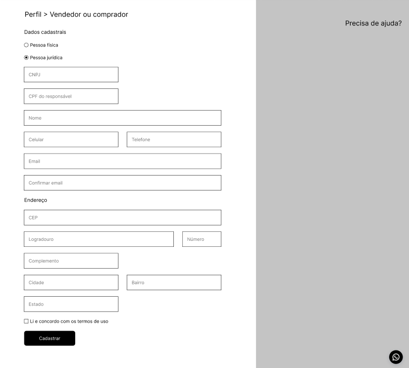

# 🚀 Desafio Wefit - API de Perfis

Bem-vindo ao repositório da solução do desafio backend da Wefit! Aqui você encontra uma API RESTful desenvolvida em Node.js para gerenciamento de perfis de usuários (Pessoa Física e Jurídica), incluindo seus endereços.

<p align="center">
  
</p>

## 🛠️ Tecnologias Utilizadas

- **Node.js** & **Express** — Backend e roteamento HTTP
- **TypeScript** — Tipagem estática para maior segurança
- **Prisma ORM** — Mapeamento objeto-relacional com MySQL
- **MySQL** — Banco de dados relacional
- **Zod** — Validação de dados e schemas
- **Swagger** — Documentação interativa da API
- **Docker** & **docker-compose** — Ambiente de desenvolvimento e banco de dados

## 📦 Como rodar o projeto

1. **Clone o repositório**

   ```sh
   git clone https://github.com/ferreiradiego/teste-backend-wefit.git
   cd teste-backend
   ```

2. **Configure as variáveis de ambiente**

   - Copie `.env.example` para `.env` e ajuste se necessário.

3. **Suba o banco de dados com Docker**

   ```sh
   docker-compose up -d
   ```

4. **Instale as dependências**

   ```sh
   npm install
   ```

5. **Gere o client do Prisma**

   ```sh
   npx prisma generate
   ```

6. **Execute as migrations do Prisma**

   ```sh
   npx prisma migrate deploy
   ```

7. **Inicie a aplicação**

   ```sh
   npm start
   ```

8. **Acesse a documentação Swagger**
   - [http://localhost:4568/docs](http://localhost:4568/docs)

## 🧪 Como testar

- Utilize o endpoint `/ping` para verificar se a API está no ar.
- Todos os endpoints de perfis estão documentados no Swagger.
- Para testar via terminal, utilize ferramentas como [HTTPie](https://httpie.io/) ou [curl](https://curl.se/):

```sh
http POST http://localhost:4568/perfis type=INDIVIDUAL name="João" email="joao@email.com" address:='{"zipCode":"12345678","street":"Rua A","number":"10","city":"SP","district":"Centro","state":"SP"}'
```

## 📚 Endpoints principais

- `POST /perfis` — Cria um novo perfil
- `GET /perfis` — Lista todos os perfis
- `GET /perfis/{id}` — Busca perfil por ID
- `PUT /perfis/{id}` — Atualiza perfil
- `DELETE /perfis/{id}` — Remove perfil

Consulte exemplos e schemas completos na [documentação Swagger](http://localhost:4568/docs).

## 💡 Observações

- O projeto utiliza validação robusta com Zod para garantir integridade dos dados.
- O banco de dados é inicializado via Docker para facilitar o setup.
- O código está modularizado em controllers, services, DTOs e schemas para facilitar manutenção e testes.

---

Feito com 💙 por Diego para o desafio Wefit.
